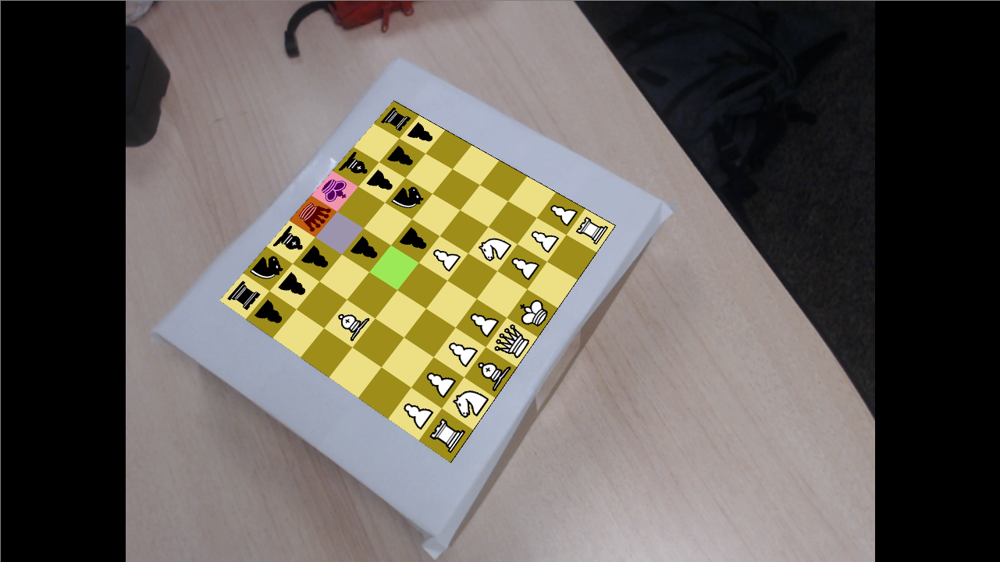
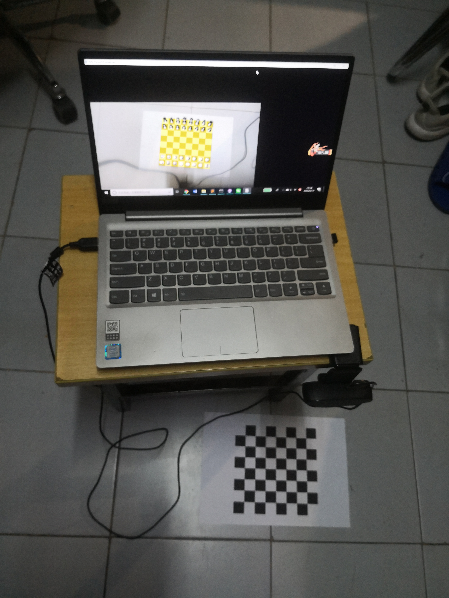

# ARchess

# Introducton
This is an augmented reality (AR) application in python. Basic chess rules are supported. Easy to use and you can make extensions easily if you want. Enjoy!

# Preparation
- Print `8x8board.pdf`. It is designed for US letter sized papaer but it is also OK if you use any other kind of papers.
- Install `python 3.5` or `python 3.6`. Using `anaconda` is recommended.
- Run `pip install opencv-python` to install opencv for python.
- Run `pip install glfw`, `pip install PyOpenGL` and `pip install pywavefront` for using OpenGL.
- Run `pip install python-chess` to install python-chess repository. See https://github.com/niklasf/python-chess for details.
- Clone this repository by running `git clone https://github.com/zuoym15/ARchess.git`

# How to play?
- Run `python caliberate camera.py`. It will pop up a window. What you need to do is to move the 8x8 checkerboard in front of the camera until 30 frames is colleced. Make the variation of view angle & distance as large as possible. Camera intrinsic parameters will be computed and stored in `camera_parameters.json`.
- Run `python ARchess.py --camera-id 0`. Make sure the checkerboard is presented in the captured image and there is no occlusion. If you have multiple cameras connected, try camera_id from 0 and find out id of the camera you want to use.
- If you want the pieces to be presented in 3d, run `python ARchess.py --camera-id 0 --d3-piece`
- Play by clicking on the pieces. Grid your mouse placed on is shown in `GREEN`. Piece you select is shown in `RED`. Possible moves is shown in `BLUE`. your king becomes `PINK` if you are checked.

# Notes
- No AI availible yet. We will consider adding an AI in the future.
- Pawn can only promote into Queen. 
- No undo could be done.

# Samples
- video demo: [click here](https://youtu.be/CRzdARkl3PQ)
- 2d-piece mode

- 3d-piece mode

- system overview (laptop + camera + checkerboard)

